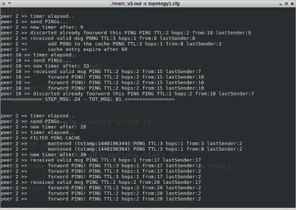
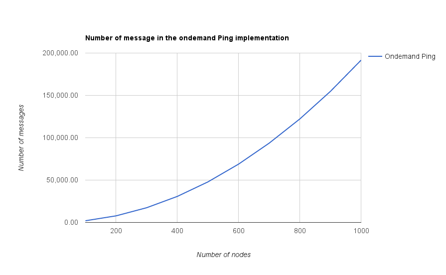
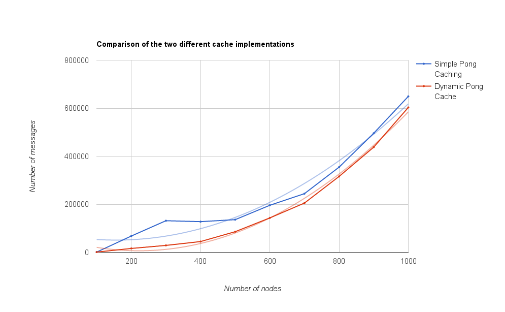

# Ping/Pong protocol simulation
The goal of this project is to simulate the Ping/Pong protocol in a Gnutella network. The software aims to simulate this kind of protocol, and all the tests are performed with this purpose, but actually the general structure of the project can lead to future work, such as implementations of other Peer-to-Peer (P2P) protocols.

<center><p><small>A possible output of the simulator</small></p></center>

Briefly, the software is based on an *infinite* loop during which peers are repeatedly asked to perform a task, usually popping some information out of a message queue and elaborating it. To better simulate this specific protocol the peers also have the possibility of setting up a time interval and performing an assigned task periodically.

# Table of Contents
* [Ping/Pong protocol simulation](#pingpong-protocol-simulation)
 * [Features](#features)
 * [How To Use it](#how-to-use-it)
	 * [Requirements:](#requirements)
	 * [Download and Install](#download-and-install)
	 * [How To Run it](#how-to-run-it)
 * [Key points in the Ping/Pong implementation](#key-points-in-the-pingpong-implementation)
	 * [On demand ping](#on-demand-ping)
	 * [Simple Pong Caching](#simple-pong-caching)
	 * [Dynamic Pong Cache](#dynamic-pong-cache)
 * [Implementation Detail](#implementation-detail)
	 * [TopologyGen](#topologygen)
	 * [Peer](#peer)
	 * [Message](#message)
	 * [Peer_p](#peer_p)
	 * [Peer_pp](#peer_pp)
 * [Statistics](#statistics)

# Features
- Random peer topology generation, given the number of nodes and the probability of two nodes being connected.
- Probing and logging a set of specific peers, either onto the standard output or onto file(s).
- Simple json like configuration file.
- Two different operational modes: simulation with log printing of the behaviour of the peer or simple message analysis.
- Three type of implementation of the Ping/Pong protocol: *on demand*, with *simple caching* and *dynamic caching*.
- Simple Peer interface easily extendible with the onEvent methods.


# How To Use it
## Requirements:
- Linux system
- g++ >= 4.8 with c++11 support
- cMake >= 3.0
- libconfig++, on ubuntu/debian system just run `sudo apt-get update && sudo apt-get install libconfig++8-dev -y`

## Download and Install
Download the last version of the software with git command or by downloading the zip file:
```
cd ~
git clone ...
```
Go inside the created directory and create the build folder where to compile the program:
```
mkdir build && cd build
```
create the makefile with cmake and start the compilation:
```
cmake ..
make
```
Now the simulator is correctly compiled and you can find three versions choose among the tree different implementations (as aforementioned) by selecting one of the executable within the `/bin` folder inside the `PingPongProtocol` directory:
- `PingPongProtocol_v1` the first version without caching.
- `PingPongProtocol_v2` the second version with simple caching.
- `PingPongProtocol_v3` the third version with the dynamic caching.

## How To Run it
To run one of the three simulations you have to create a configuration file or use one of the given examples. For instance you can run the simulation of the second version of the protocol by using the configuration file `topology_2.cfg`, with the following:
```
bin/PingPongProtocal_v2 -c example/topology_2.cfg
```
That configuration file creates a random topology with 50 peers, 0.1 as connections probability and a seed of 234234324443334. Instead in the *logger* property is specified which peer has to be logged and where; in the specific example: only the peers 23, 10, 3 and 15 print out their logs, and respectively onto the standard output for the first couple and onto the file  `pippo.log` for the second couple. It is also specified that the random graph topology of the peers has to be written into the `topology.log` file.

There are different selectable options in order to launch the executable: the `-c` that specifies a configuration file is given, the `-s` to specify the number of simulation steps to be run.

To use the simulator only for printing the number of messages in the network and without any other additional information, for example to get some statistics, you can use instead the parameters:
- `-n` number of nodes in the network
- `-p` probability of connection between two peers
- `-r` to sepcify the seed of the random generator.

If you use at least one of the latter options, then all the printing information is disabled. A possible command in this sense can be:
```
bin/PingPongProtocal_v2 -n 1000 -p 0.1 -s 1000 -r 4815162342   
```

# Key points in the Ping/Pong implementation
In this section we will skim through all the key ideas behind the implementation of the three versions of the Ping/Pong protocol. In general we can say that all the simulation is about the raw communication of the peer and how the messages are distributed in the network; for this reasons there is no kind of simulation for what concerns the connection via sockets nor for the error occurring during network communication.

## On demand ping
In the following, the base structure of the Ping/Pong protocol is described in its details. Each peer is programmatically triggered and broadcasts a ping message to its neighbours, this is done by invoking the method `putMessage(Message)` which pushes a new message on the receiver peer queue. Then all the peer that receive a Ping respond with a Pong and forward the ping to their neighbours.

An important aspect is how the Pong messages are routed back towards the original sender of the ping. To achieve this a HashMap is exploited to store the original sender of every received Ping message. This structure adopts as key the id of the message and as value the UID (Unified Identifier) of the peer that has sent that message (in general it can be different from the original sender). In this way the peers can perform backward routing hop-by-hop for the Pong to reach the original sender. Here is the definition of the HashMap:

```
std::unordered_map<int, int> pingTable;
```

It is important to consider that the access to this structure is constant in time, so that a minimal overhead is paid every time the node receives a Pong.

The same structure is also used to recognise the Ping sent by the peer itself or its answer Pong, in fact each time a peer sends a new ping it inserts it into the pingTable the id of the message and a constant -1 (to recall that the message was generated at that peer).
Doing so, it is possible to perform some other check during the ping forwarding, to improve the effectiveness of the broadcast and to reduce content replication, i.e.:
- already forwarded pings are not forwarded (it is possible that there is a cycle in the peer graph),
- both pings and pongs generated at one peer are recognised by that specific peer and retained from forwarding.

## Simple Pong Caching
This version of the peer has all the structure explained before for the on demand ping, but it also includes these features:
- the ping are sent after a variable number of seconds (by default between 5 and 30 seconds)
- the peer exploits a cache of Pongs, thus avoiding to forward every time all every incoming ping messages to its neighbours.

The implementation of the pongCache is driven by the idea to have a faster data structure with constant time for insertion and retrieval, because it needs to be accessed every time a peer receives a new ping from the network.

Practically the structure is a HashMap of HashMap, to exploit the constant access time to retrieve the cache entry for one of the neighbor and to avoid replication of the Pong of the original sender.
```
std::unordered_map<int, // neighbor id
                   std::unordered_map<int, // original sender
                                      unique_ptr<Message>>> pongCache;
```
So logically the structure can be considered as a set of many distinct caches, one for each neighbour, in which there are key-value pairs, with the original sender of the message and the message itself.

To clarify this type of structure we can analyse the behaviour of the cache when it is filled by incoming pongs and when this pongs are retrieved and sent back to the requester.

First of all, every time a new Pong arrives from one of the incoming links this new message is saved in the cache of that neighbor using the UID of the original sender as second index of the structure. Consequently, every time a new Pong from the same sender is received, it overrides the older one without introducing any data duplication.

In the other case, when a new Ping arrives from one of the neighbours, a loop starts over the cache and if at least one message is present on that cache, it will be sent back to the requester , without forwarding the ping. Otherwise, for empty cache entries, the classic behaviour is implemented.

## Dynamic Pong Cache
This version of the peer has all the cache facility of the previous versions, but improves the system with a dynamic cache where every entry is deleted after a number of seconds (by default 60). To add this new feature the previous cache structure is kept untouched and a LinkedList is added  where to put all the time information needed by the filtering process.

More in detail every time the peer receives a Pong it stores it in the pongCache as in the previous example, but now it also adds a new entry at the end of the timeList, with the the timestamp generated by adding the actual time to the default expiring value of 60 seconds. In this way the list is kept ordered on the timestamps of the cache entries.

Then, every 30 seconds by default the filtering process of the cache starts and the list is scanned to find elements with a time stamp less of the actual time. When a entry with this characteristic is found the system uses the information stored inside the linked list node to remove the cache entry in the pongCache and also the entry in the timeList is popped out. It can be easily seen that the filtering process can be stopped before that all the list is scanned since when a list node with a greater time stamp of the actual time is found, no other node with a smaller time stamp can be found in the (ordered) list.

# Implementation Detail
In this section we will see more in detail the structure of the classes with a description of the more relevant constructor and method for each of them.
The main class in the project are the `TopologyGen`, that manage and generate the peer structure, the `Peer` that represent a peer entity and the `Message` that simulate the structure of the Ping/Pong message with the needed information.
Than there are same utility class as the `ArgsParser` to read the argument of the command line and the `Logger` used to probe and log the activity of a set of peers.

## TopologyGen
This class generates and manages the peer topology, it can random create a peer topology given a configuration file or it possible to manually give an already define vector of peers. Here are the main constructor:
- `TopologyGen(vector<shared_ptr<Peer>> peers_list)` create a TopologyGen object given an already define vector of Peers.

- `TopologyGen(Config& configuration_file)`  create a TopologyGen object given a configuration file, it use the parameters in the configuration file to create a random topology.

- `TopologyGen(int n_of_node, double connection, long r_seed)`  create a topologyGen object manually given the number of nodes, the probability of connection and a random seed.


After the creation of the object is possible to interact with the peer by the following method:

- `void simulate(function<void(Peer&)> call_back)` this is the main interface with the peers, this function execute one cycle of simulation among the peers, and after execute the callback function. There are other version of this function in witch is possible to specified, how much work each peer have to compute, and the sleep time between to peer execution.

- `void startPing(int p)` manually trigger a given peer to send a ping message to all its neighbor, it is used in the *on demand* version of the Ping/Pong.

- `void print()` this function just print the topology structure of the peers.

## Peer
It is the class specifying all the characteristic of a peer in the network, it have a list of connected peers, and a message queue where the other peers can put messages. It can be created by the following constructor:
- `Peer()` create a new Peer with a unique id.
- `Peer(int uid, shared_ptr<Logger> l)` create a new instance with a specific id and a Logger object
- `Peer(shared_ptr<Logger> l)` create a new instance with a Logger.

- `void work(int time_quanto)` this method run for a number of time set by the parameter `time_quanto` the work of the peer. When invoked basically the peer first check if one of is timer are elapsed and then pop a number of message equal to the parameter `time_quanto` from the queue, and then work on it.  

- `void putMessage(unique_ptr<Message> msg)` put a new message in the queue of the peer.

- `void sendPing()` trigger the peer to broadcast a new ping message to all their neighbor.

- `bool addNeighbor(shared_ptr<Peer> p)` add a new neighbor to the peer, this method simulate a bidirectional connection to a new peer. In this way after the executing of the method the two peers will have in their neighbor list the new connection.

In the Peer class there is also other event based method used to implement the actual behavior of the Ping/Pong message protocal. This method are actually the one extended by the `Peer_p` an `Peer_pp` class. More in detail we can see:

- `virtual void onValidPing(unique_ptr<Message> msg , int sender_neighbor)` and `virtual void onValidPong(unique_ptr<Message> msg, int sender_neighbor)` called when the peer receives a valid Ping or Pong (the TTL is not 0) with the received message and the neighbor that send it.

- `virtual void onErrorMsg(unique_ptr<Message> msg, ErrorType error, int neighbor)` called when a not valid message is sent to the peer, it contains a `ErrorType` that represent the specific error of the message. It can be one of the following:
    + `ALREADY_FORWARDED_PING` received a ping that is already forwarded and already is in my ping table.

    + `UNOKNOW_PONG` received a Pong for witch there isn't information in the ping table, so the routing back information is missing.

    + `EXPIRED_MSG` the message received have a expired TTL.

    + `MY_PING` receive my Ping

    + `MY_PONG` receive my Pong, so actually it is good, it is here only to have a more general structure of the system.

## Message
This class represent the actual message exchanged between the peers. It don't have the exact structure of the PING/PONG message, but keep all the information needed to simulate the same behavior. The actual field are:
- `int id` the unique id of the message.
- `MsgType type` the type of the message: `PING` or `PONG`
- `int TTL` the time to live of the message by default it is set to 4
- `int HOPS` the hops that the message did, how many peer it traverse
- `int originalSender` it represent the id of the peer that generate the message the first time.
- `int lastSender` it represent the previous hop sender, in other words the neighbor that send the message to the peer. In a real protocol implementation this information can be taken by the socket connection information, but this simulation each entry in the queue are identically so it is important to distinguish witch neighbor put that message.

## Peer_p
This class extended `Peer` and add the a Pong cache with the possibility to exploit the already saved Pong instead of broadcast every time the Ping and wait for all the Pong. This is implemented by the following method called when a valid Ping or Pong are received:

- `virtual bool addPongCache(int neighbor, unique_ptr<Message> msg)` this store a message in the pongCache using the neighbor_id as key of the HashMap, to achieve constant time retrieve.

- `virtual void sendChachedPong(int to,unique_ptr<Message> msg)` if at least one message is in the pong cache, send this pong without broadcast the ping. If no message are found in the cache the ping is regularly broadcast to the neighbor.

## Peer_pp
This class extended the `Peer_p` and add a linked list in witch store the time stamp of every cache entry. The node store inside the list have the following field:
```
struct ListNode {
  time_t tstamp;         //time stamp of the entry
  int    original_sender;
  int    neighbor_id;
  int    msg_id;
};
```
Extending the on `addPongCache` method of the `Peer_p` class each time a new pong is added to the cache is also add at the end of the list a new entry of the ListNode struct. The list in this way is organize with ordered time stamp.
Then to add the capability to send the Pong store in the cache only if they are more that K, also the method `sendChachedPong` of the class `Peer_p` was extended.

This class add also another timeout that by default every 60 second by default check and clear the cache entry, as it is describe in the previous section.

# Statistics
One of the aim of this project is to run same analysis on the Ping/Pong protocol and the implemented cache system. For this reason the analyses take care of the number of message that flood the network in the different implementations. Obviously the first implementation of the protocol, the on-demand ping, is not confrontable with the other because the peer doesn't periodically generate ping message.

Anyway all analysis are done on random network of different number of peers, from 100 to 1000, the connection probability is set to 0.1 and the simulation runs 2000 steps.

In this first graph we have plot the the distribution of the message in the on-demand implementation. This analysis only a peer is triggered and so it sends a ping to all its neighbor an wait for the corresponding Pong.

<center></center>

In this second graph we have plot the comparison of the two cache implementations when the number of nodes grouse.
We can see that those curves are similar to each other, but for the same number of peer the final implementation have alway less number of message that flood the network.

<center></center>

Possible the improvement of the last version van be actually better of this if we consider a dynamic network, where the cache expiring system can is actually better than the second version. But never than less the use of the cache when we have at least K=4 element can achieve a better performance.
